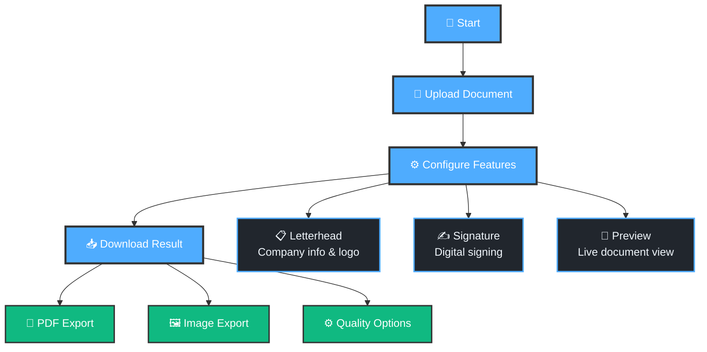

# Docr - Professional Document Processing

A modern, dark-themed web application for adding professional letterheads and digital signatures to documents. Built with Next.js 14, TypeScript, and Tailwind CSS.

## 🔄 Application Flow



## ✨ Features

- **🎨 Professional Letterhead**: Company branding, logo integration, custom styling
- **✍️ Digital Signatures**: Multiple styles (handwritten/typed/image) with drag positioning
- **📄 Multi-Format Support**: PDF, Word docs, images (up to 10MB)
- **🌙 Dark-First Design**: Modern UI with blue accents
- **⚡ Real-time Preview**: Interactive document preview

## 🚀 Quick Start

```bash
# Clone and install
git clone <repository-url>
cd docr
npm install

# Start development
npm run dev
# Open http://localhost:3000
```

## 📁 Project Structure

```
docr/
├── app/                     # Next.js 14 App Router
│   ├── document-processor/  # Upload page
│   ├── letterhead-signature/# Config page  
│   ├── process-document/    # Processing page
│   └── page.tsx            # Landing page
├── components/             # React components
│   ├── document-preview/   # Preview with interactions
│   ├── letterhead/         # Letterhead editor
│   ├── signature/          # Signature editor & dragging
│   └── ui/                 # Base UI components
├── lib/                    # Core logic
│   └── document-processor.ts # Processing engine
└── types/                  # TypeScript definitions
```

## 🛠️ Technology Stack

- **Framework**: Next.js 14, TypeScript, Tailwind CSS
- **UI**: Radix UI, shadcn/ui, Lucide React
- **Processing**: html2canvas, jsPDF, React Dropzone

## 🎯 Usage

1. **Upload**: Drag & drop or browse files (PDF, DOC, images)
2. **Configure**: Choose letterhead and/or signature features
3. **Customize**: Add company details, upload logos, position signatures
4. **Process**: Select output format (PDF/PNG/JPG) and quality
5. **Download**: Get your professionally formatted document

## 🔧 Configuration

- **No environment variables** required for basic functionality
- **Client-side processing** - no server required

## 📱 Browser Support

- Chrome 90+, Firefox 88+, Safari 14+, Edge 90+
- Requires: File API, Canvas API

## 🛡️ Security & Privacy

- **100% client-side processing** - documents never leave your browser
- **Session storage only** - temporary data cleared after use
- **No server uploads** - complete privacy protection

## 🚀 Deployment

```bash
# Production build
npm run build
npm start

# Deploy to Vercel
npm install -g vercel
vercel
```

## 🐛 Troubleshooting

**File upload issues**: Check file size (<10MB) and format support
**Processing errors**: Check browser console, verify required fields

## 📄 License

MIT License - see [LICENSE](LICENSE) for details.

---

**Docr** - Professional document processing in the dark. Built with ❤️ for modern workflows.
